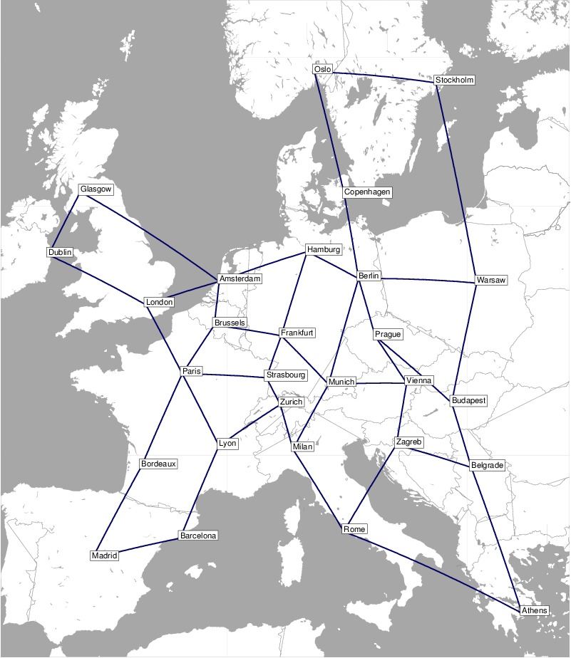

# AntColonyOptimization

The aim of this project is to implement an [Ant Colony Optimization (ACO)](https://en.wikipedia.org/wiki/Ant_colony_optimization_algorithms) algorithm, which will then be tested on the nobel-eu network from [SNDlib](http://sndlib.zib.de/home.action). In this project ACO is used to find the shortest path between two nodes in a graph. The simplicity of this problem allows to easily compare solutions generated by ACO to the optimal ones.

## Modes

The program can run in 2 modes: <i>interactive</i> and <i>test</i>.

<i>Interactive</i> mode displays the map of the network and allows you to pick start and end node for the path search. Then the algorithm will run in real time. The width of the link corresponds to the current pheromone level.

<i>Test</i> mode allows you to compare the quality of found solutions against other algorithms, which always provide the optimal solution. No map of the network will be displayed, however a chart with detailed results will be presented when the program finishes running.

## Network metrics

In order to find the shortest path between two nodes, two distinct metrics can be used:

* each link has weight equal to 1 (compared against BFS algorithm)
* each link has a different weight, equal to distance in kilometers between two nodes (compared against Dijkstra algorithm)

## Map of the network

